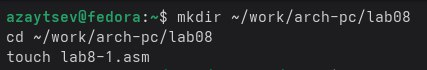

# Лабораторная работа №8  
## Программирование циклов и обработка аргументов командной строки

### Цель работы
Освоить базовые приёмы работы с циклами, регистрами, стеком и аргументами командной строки в языке ассемблера NASM.

---

## Задание 1 — Программа с циклом и вводом N



Программа запрашивает число N, после чего выводит все значения от N до 1.

### Листинг lab8-1.asm
```asm
%include 'in_out.asm'

SECTION .data
    msg1 db 'Введите N: ',0h

SECTION .bss
    N: resb 10

SECTION .text
global _start

_start:
    mov eax, msg1
    call sprint

    mov ecx, N
    mov edx, 10
    call sread

    mov eax, N
    call atoi
    mov [N], eax

    mov ecx, [N]

label:
    mov eax, ecx
    call iprintLF

    loop label

    call quit
```

---

## Задание 2 — Вывод аргументов командной строки


### Листинг lab8-2.asm
```asm
%include 'in_out.asm'

SECTION .text
global _start

_start:
    pop ecx
    pop edx
    sub ecx, 1

next:
    cmp ecx, 0
    jz _end

    pop eax
    call sprintLF

    loop next

_end:
    call quit
```

---

## Задание 3 — Произведение аргументов командной строки


### Листинг lab8-3.asm
```asm
%include 'in_out.asm'

SECTION .data
    msg db "Результат: ",0

SECTION .text
global _start

_start:
    pop ecx
    pop edx
    sub ecx, 1

    mov esi, 1

next:
    cmp ecx, 0
    jz _end

    pop eax
    call atoi
    imul esi, eax

    loop next

_end:
    mov eax, msg
    call sprint

    mov eax, esi
    call iprintLF
    call quit
```

---

## Самостоятельная часть — f(x) = 7 + 2x


### Листинг main.asm
```asm
%include "in_out.asm"

SECTION .data
    msg_func db "Функция: f(x)=7+2x",0
    msg_res  db "Результат: ",0

SECTION .text
global _start

_start:
    pop ecx
    pop edx
    sub ecx, 1
    mov esi, 0

next:
    cmp ecx, 0
    jz _end

    pop eax
    call atoi

    mov ebx, eax
    imul ebx, 2
    add ebx, 7

    add esi, ebx
    loop next

_end:
    mov eax, msg_func
    call sprintLF

    mov eax, msg_res
    call sprint

    mov eax, esi
    call iprintLF

    call quit
```

---

## Вывод
В ходе лабораторной работы были изучены циклы, стек, аргументы командной строки, а также реализована функция варианта f(x)=7+2x.

## Список литературы
1. Методические указания преподавателя.
2. Документация NASM.
